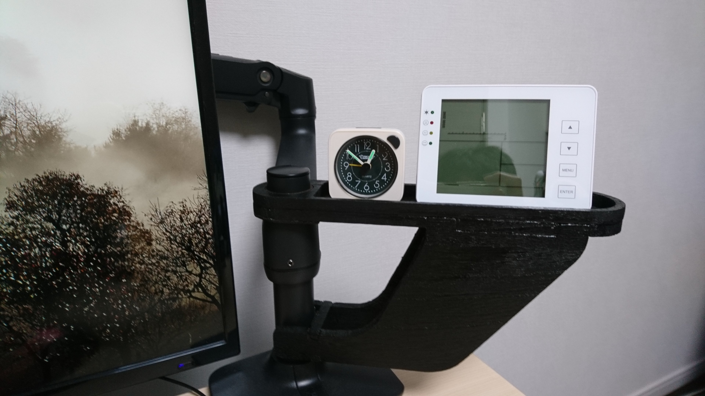
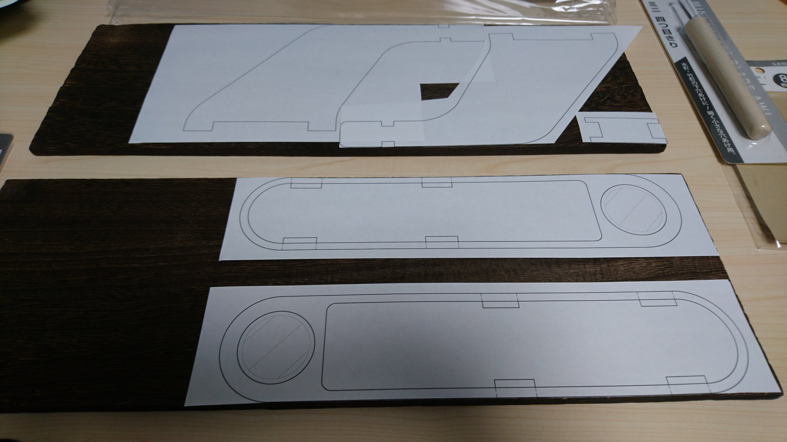
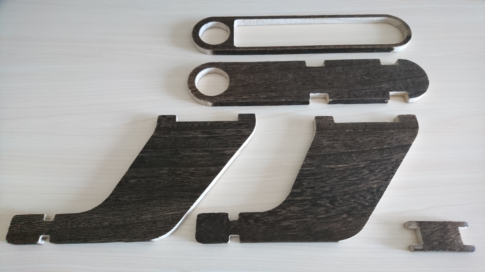
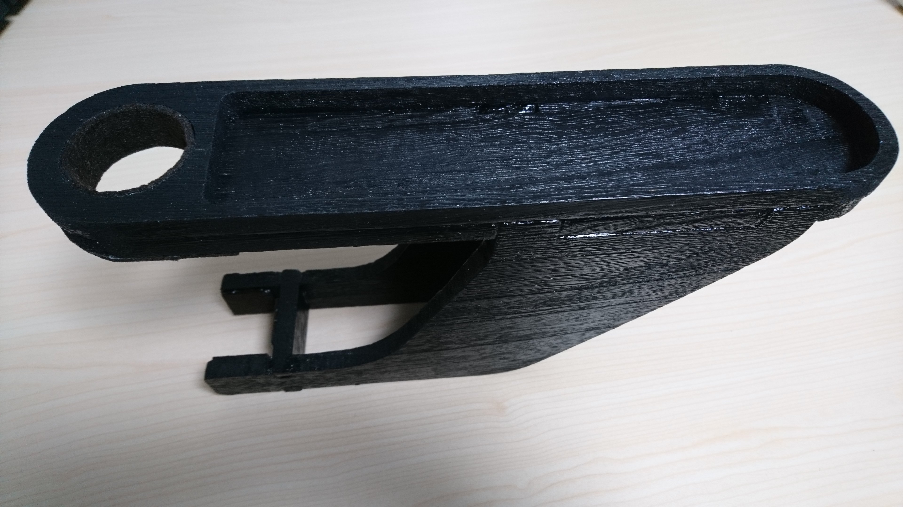

# LibreCAD_armStand
エルゴトロンのモニタアーム接続できる台の図面

## 完成写真＆使用例

## 図面
図面は LibreCAD で作成しました．手抜きなので最低限しか記載されていません．
なお，LibreCAD の使い方は [簡単な例 - LibreCAD](http://machineshop.web.fc2.com/LibreCAD/example1/index.html) を見ると 3~ 6 時間くらいで習得できます．
また，LibreCAD のインストール方法は [0から学ぶ LIBRECAD : 2 導入方法](https://femoghalvfems.info/librecad-ja/002-2) が参考になります．

## 部品一覧
- 材料一覧
  | 材料名 | 購入場所 | 単価 (概算) [円] | 数量 [個] | 合計 [円] | 備考欄 |
  | ------ | ------- | ---------------- | --------- | -------- | ------ |
  | 木材 (450x150mm x 9mm) | セリア (100円均一) | 110 | 2 | 220 | |
  | 木工用ボンド | セリア (100円均一) | 110 | 1 | 110 | 部品の接着に使用します |
  | 塗料 (黒・つや消し 200 ml 缶)  | ホームセンター | 600 円くらい | 1 | 600 | 手持ち在庫を使用．テカテカだと鬱陶しいので，つや消しをお勧めします． |
  | フェルト | セリア (100円均一) | 110 | 1 | 110 | 手持ち在庫を使用 |

- 補助道具一覧
  | 補助道具名 | 購入場所 | 単価 (概算) [円] | 数量 [個] | 合計 [円] | 備考欄 |
  | ------ | ------- | ---------------- | --------- | -------- | ------ |
  | 塗装用の筆 (5本セット) | セリア (100円均一) | 110 | 1 | 110 | 手持ち在庫を使用 |
  | 糸のこ (替刃付き) | ホームセンター | 350円くらい | 1 | 350 |  |
  | 万力 | セリア (100円均一) | 110円 | 2 | 220 | 糸のこでの切断時に，材料を机に固定する |
  | 固定用の木材 | セリア (100円均一) | 110 | 2 | 220 | 手持ち在庫を使用．万力の痕が残らないように，材料固定時に間にはさみます． |
  | キリ | セリア (100円均一) | 110 | 1 | 110 | 糸のこの歯を飛び地に通すために使用します |
  | サンドペーパー | セリア (100円均一) | 110 | 1 | 110 |  |
  | かまぼこの板 | スーパーマーケット | --- | 1 | --- | ヤスリがけの際にサンドペーパーを保持する (平面を出す) のに使用します．かまぼこの板は握りやすく丁度よいサイズです．手持ち在庫を使用 |

- 出費合計
  - 今回出費: 1120 円 (手持ち在庫除く)
  - 出費: 2160 円 (手持ち在庫含む)

## 作り方
1. 図面を等倍で印刷し，材料の木材に糊で貼り付けます．
   

2. 糸のこで切断します．
   加工のポイント
   - 切断のポイント: 少し (0.5mmくらい) 大きめに切断して，周りをヤスリがけします．なお，大きすぎるとヤスリがけが大変なので注意です．
   - ヤスリがけのポイント: 大きさの同じ部品を万力で固定し，位置が揃うようにヤスリがけします．
   注意点
   - 騒音: マンションでの加工には注意が必要です．今回は締め切ったお風呂場で加工しました．
   - 時間: 1 つの部品加工するのに 2~ 3 時間かかります．手動だと結構大変なので，覚悟が必要です．

   

3. 組み立て・接着・塗装およびフェルトの貼り付け
   
   組み立て・接着のポイント
   - 木材は天然物のため反りがあります．実際に組み上げると，かなり歪んでいるはずです．
     歪んでいるものは仕方がないので，ポールの通る軸が直線となるように，接着します．
     このとき，木工用ボンドを付けて組み上げた状態で，机の上に横倒しにして，なるべく直角になるように調整することがポイントです．
   
   塗装のポイント
   - ボンドが乾き十分に固定されてから塗装します．
   - 換気に気をつけて！換気扇を回しましょう．

   フェルト貼り付けのポイント
   - モニターアームとの接触面全てにフェルトを貼ります．
   - フェルトの厚みを考慮した寸法のため，フェルトを貼らないとガタガタになります．
   
   

4. モニターアームにマウントして完成です！
   
